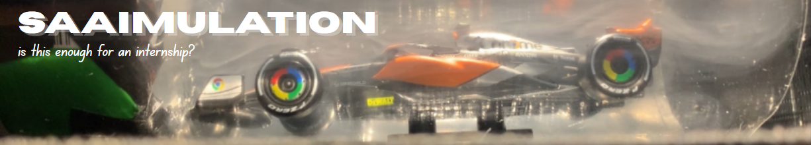

  

# Hi, I’m Saaim 👋  

🚀 Aerospace Engineering student at the University of Leicester

🏎️ Aspiring Aerodynamicist at Formula 1!

🛠️ CAD, CFD, wind tunnels, and 3D printers (I break them more often than I should, but that’s part of the fun)  

---

## 🌍 About Me  
- Building personal projects in **aerodynamics and aero testing** (mini wind tunnels, CFD studies, F1-inspired aero parts).  
- Currently teaching myself **Python** so I can stop bullying Excel into doing things it wasn’t designed for.  
- Proud owner of a Bambu A1, after saying goodbye to the Ender 3 Pro. My house sounds like a factory at 3am.  
- Huge fan of learning by doing… and redoing… and occasionally duct taping.
- NOT Tony Stark, but I am slowly trying to get there :D

---

## 📂 Featured Projects  
🔹 [**Mini Wind Tunnel – Mark I**](https://github.com/saaimulation/Mini-wind-tunnel)  
First attempt at building a tunnel from cardboard, bottles, and a Pringles can. It worked… sort of. Smoke flow was chaotic, but so was the design. Learned more from this than any textbook.  

🔹 [**Project: Aero**](https://github.com/saaimulation/Project-Aero)  
Designing a 2026-regulated F1 front wing in Siemens NX, then testing it in SimScale CFD.  
Then 3D printing the wing at a smaller scale, and testing it in a new and improved wind tunnel!
Basically me seeing if student laptops + duct tape can stand up against a £135m aero department.  

🔹 **3D Printing Aero Parts** (coming soon)  
Because if it isn’t in plastic on my desk, does it even exist?  

---

## 🎯 Currently working on...
- Learning Siemens NX to design and model a 2026 regulation F1 front wing. 
- Thinking of a plan to create Wind Tunnel Mark II

---

## ⚡ Fun Facts  
- Built my first “wind tunnel” out of cardboard and a Pringles can. It *technically* worked.  
- I believe duct tape should be considered a legitimate engineering material.  
- Anime fight scenes lowkey inspire my aero concepts. Don’t ask why.  

--- 

## 📫 Get in Touch!!

---

<!--
**saaimulation/saaimulation** is a ✨ _special_ ✨ repository because its `README.md` (this file) appears on your GitHub profile.

Here are some ideas to get you started:

- 🔭 I’m currently working on ...
- 🌱 I’m currently learning ...
- 👯 I’m looking to collaborate on ...
- 🤔 I’m looking for help with ...
- 💬 Ask me about ...
- 📫 How to reach me: ...
- 😄 Pronouns: ...
- ⚡ Fun fact: ...
-->
