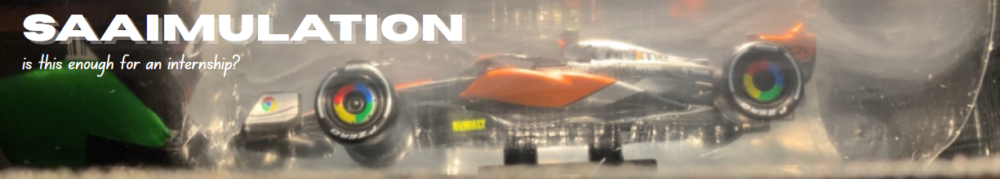

  

# Hi, I’m Saaim 👋  

🚀 Aerospace Engineering student at the University of Leicester

🛠 I like building things, whether that’s wind tunnels, F1 parts or projects that become way more complicated than they needed to be

⚙ CAD, 3D printing, prototyping, engineering chaos, and occasionally setting my printer up for failure

---

## 🌍 About Me  

• Most of my projects start with:
  “This sounds cool” and somehow end at 3am with broken CAD

• Started with motorsport and aero stuff, now I mostly just enjoy building things and figuring out how they work

• Currently trying to combine engineering with cosplay builds, electronics, and other questionable ideas

---

## 📂 Featured Projects  
🔹 [**Mini Wind Tunnel – Mark I**](https://github.com/saaimulation/Mini-wind-tunnel)  
First attempt at building a tunnel from cardboard, bottles, and a Pringles can. It worked… sort of. Smoke flow was chaotic, but so was the design. Learned more from this than any textbook.  

🔹 [**Project: Aero**](https://github.com/saaimulation/Project-Aero)  
Designing a 2026-regulated F1 front wing in Siemens NX to learn more about aero design, CAD surfacing, and engineering workflows.  
Started as a CFD project, but honestly became more about redesigns, feedback, and figuring out why things were not working.  
Includes detailed critique and advice from an Alpine F1 aerodynamicist.

🔹 [**"UAV Is Online"**](https://github.com/saaimulation/UAV-Is-Online)  
Personal CFD log for the UoL AeroLabs team. Building a laptop friendly baseline in SimScale,   
then nudging geometry for small, repeatable gains. Rules PDF linked. No raw CAD here, just plots and notes.

🔹 [**FS26 Aerodynamics (private)**](https://github.com/saaimulation/UoL-Racing-FS26-Aerodynamics)  
♦ [FS26 Aerodynamics (Private)](https://github.com/saaimulation/UoL-Racing-FS26-Aerodynamics)
Small repo documenting some of my early CFD and aerodynamics work within the 2026 UoL Formula Student team.  
Mostly workflow notes, setup attempts, and lessons learned while getting familiar with team development tools and processes.

🔹 **Codename: Blue Steel** (coming soon)  

---

## 🎯 Currently working on...

- Learning more hands-on manufacturing and prototyping skills
- Leading the aerodynamics team for the IMECHE UAS challenge
- Planning future engineering/cosplay builds because apparently I enjoy making life difficult for myself
- Trying to turn dumb ideas into real projects without declaring bankruptcy

---

## ⚡ Fun Facts  
- Built my first “wind tunnel” out of cardboard and a Pringles can. It *technically* worked.  
- I believe duct tape should be considered a legitimate engineering material.  
- Anime fight scenes lowkey inspire my concepts. Don’t ask why.  

--- 

## 📫 Get in Touch!!

---

<!--
**saaimulation/saaimulation** is a ✨ _special_ ✨ repository because its `README.md` (this file) appears on your GitHub profile.

Here are some ideas to get you started:

- 🔭 I’m currently working on ...
- 🌱 I’m currently learning ...
- 👯 I’m looking to collaborate on ...
- 🤔 I’m looking for help with ...
- 💬 Ask me about ...
- 📫 How to reach me: ...
- 😄 Pronouns: ...
- ⚡ Fun fact: ...
-->
